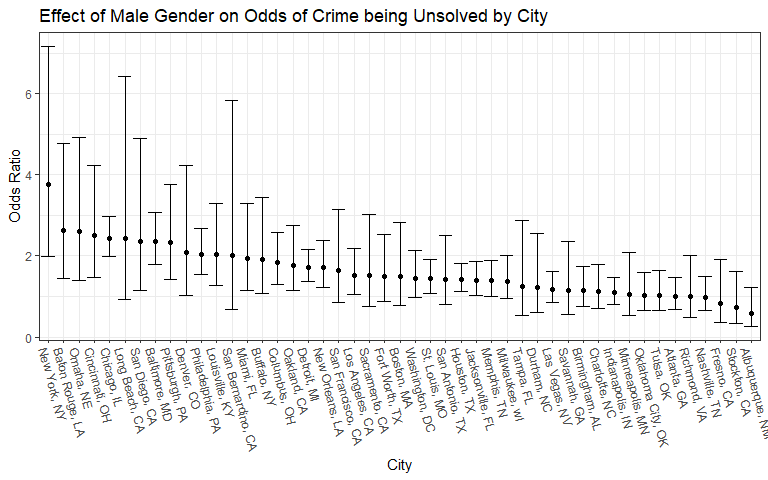

hw6
================
Sean Sorek
2024-12-02

``` r
homicide <- read_csv("data/homicide-data.csv") |>
  mutate(
    city_state = stringr::str_c(city, state, sep = ", "),
    unsolved = map_lgl(
      disposition,
      \(i) str_detect(i, "Closed without arrest") ||
        str_detect(i, "Open/No arrest")
      ),
    victim_age = as.integer(victim_age)) |> 
  filter(!(city_state %in% c(
    "Dallas, TX",
    "Pheonix, AZ",
    "Kansas City, MO",
    "Tulsa, AL"
  )),
  victim_race %in% c("White", "Black")) |>
  na.omit()
  
homicide |>
  filter(city_state == "Baltimore, MD") |>
  glm(unsolved ~ victim_age + victim_sex + victim_race, data = _, family = "binomial") |> 
  broom::tidy() |>
  mutate(
    lower_coef = estimate - 1.96*std.error,
    upper_coef = estimate + 1.96*std.error,
    lower_odds = exp(lower_coef),
    upper_odds = exp(upper_coef),
    odds_ratio = exp(estimate)
    ) |> 
  filter(term == "victim_sexMale") |>
  select(lower_odds, odds_ratio, upper_odds)
```

    # A tibble: 1 × 3
      lower_odds odds_ratio upper_odds
           <dbl>      <dbl>      <dbl>
    1       1.79       2.35       3.08

``` r
get_gender_odds_ratio <- function(x){
  x |>
    glm(unsolved ~ victim_age + victim_sex + victim_race, data = _, family = "binomial") |> 
  broom::tidy() |>
  mutate(
    lower_coef = estimate - 1.96*std.error,
    upper_coef = estimate + 1.96*std.error,
    lower_odds = exp(lower_coef),
    upper_odds = exp(upper_coef),
    odds_ratio = exp(estimate)
    ) |> 
  filter(term == "victim_sexMale") |>
  select(lower_odds, odds_ratio, upper_odds)
}
homicide |>
  nest(data = -city_state) |>
  mutate(
    results = map(data, get_gender_odds_ratio)
  ) |>
  unnest(results) |> select(-data) |>
  mutate(
    city_state = as.factor(city_state),
    city_state = fct_reorder(city_state, odds_ratio, .desc = T)
  ) |>
  ggplot(aes(city_state, y = odds_ratio,
             ymin = lower_odds, ymax = upper_odds)) + geom_errorbar() + geom_point() +
  theme_bw() +
  theme(axis.text.x = element_text(angle = -75, hjust=0)) +
  labs(x = "City", 
       y = "Odds Ratio",
       title = "Effect of Male Gender on Odds of Crime being Unsolved by City")
```


